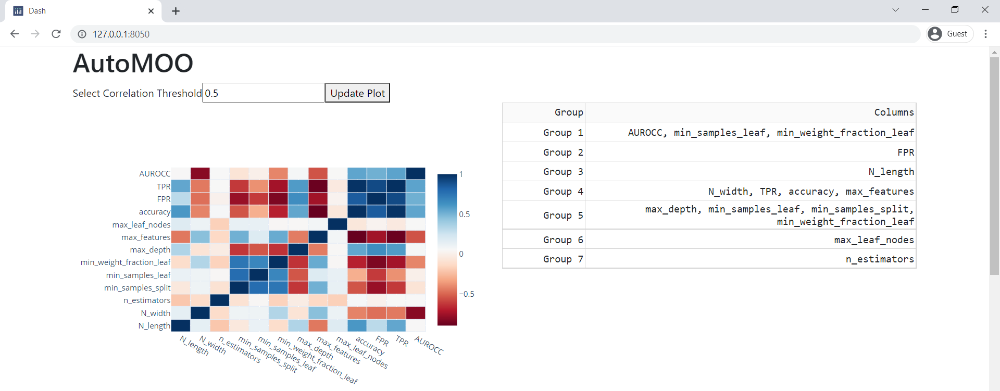
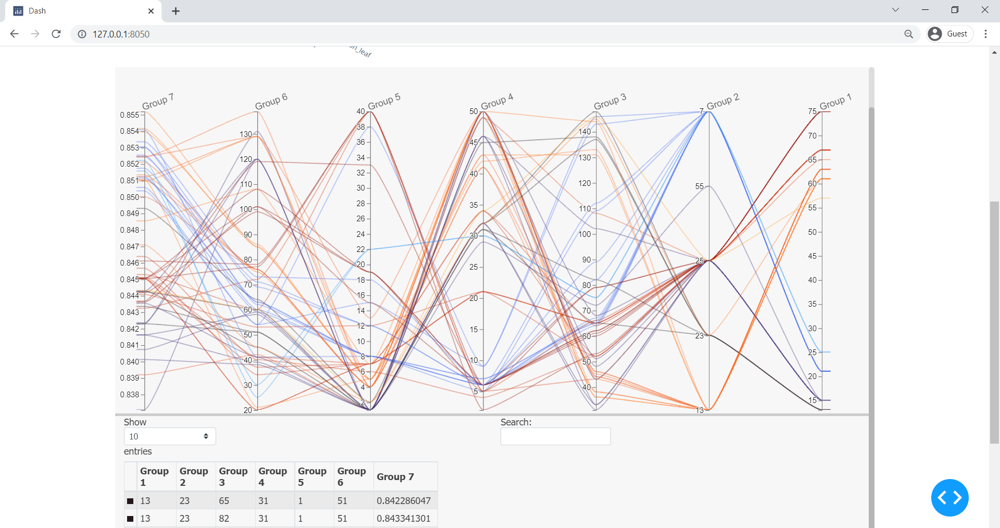

# autoMOO
Automating the visualization of high-dimensional multi-objective optimization results

# Usage
## Comand Line
This tutorial assumes the use of [gitbash](https://git-scm.com/downloads) or a Unix-like terminal with github command line usage.
1. This project utilizes conda to manage environments and ensure consistent results. Download [miniconda](https://docs.conda.io/en/latest/miniconda.html) and ensure you can activate it from your terminal by running `$conda activate` 
    * Depending on system configuration, this can be an involved process [here](https://discuss.codecademy.com/t/setting-up-conda-in-git-bash/534473) is a recommended thread.
3. Clone the repository using `$git clone https://github.com/janeBrusilovsky/autoMOO.git` 
4. Change to the current working directory using `$cd <insert_path>/autoMOO`
5. Change `input` in `config.ini` to match the dataset you prefer to analyze.
6. Run the analysis by running `$bash run.sh`
## Native Python
AutoMOO can also be incorporated directly into Python workflows for example:
```
import utils

# Importing data
data = utils.file_reader(<path_to_csv>)

<insert workflow here>

# Create dashboard
app = utils.create_dashboard(
    data=data,
    cor_colormap=cor_colormap
)

# Run dashboard
app.run_server(debug=True)
```

# Example Output
Here is an example autoMOO dashboard for one of the included default datasets!



# Contents
```
autoMOO
│   LICENSE
│   README.md
│   .gitignore
│   main.py: Example run of autoMOO
│   utils.py: AutoMOO utilites
│   environment.yml: Conda environment
│   utils_testing.py: Unit testing for `utils.py`
│   run.sh: Bash script to create conda environment and run `main.py`
│
├───example_datasets: Example datasets for AutoMOO
│       machine_learning_dam_hazard.csv
│       water_energy_sensitivity.csv
|
├───autoMOO: AutoMOO documentation
│   └───static: Static images of example dashboard
│           autoMOO_bottom.PNG
│           autoMOO_top.PNG
│
└───.github: Github actions
    └───workflows
            python-package-conda.yml
```
